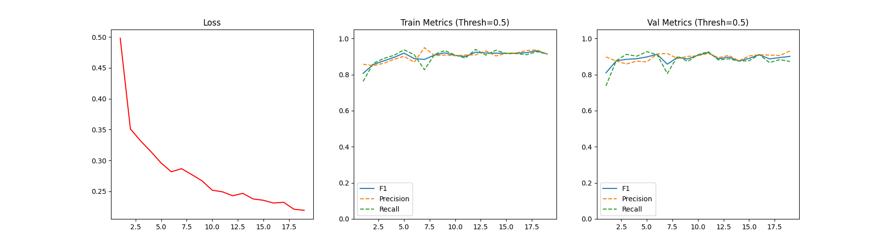

# Machine Learning Course Project Report: Task 1

**Student ID:** PB23000000
**Name:** [Your Name Here]

---

**Task 1 F1-score on Test Set ($s_1$): 0.7252**

---

## 1. Introduction
Glass quality inspection is a critical component of industrial production. In this project, we aim to automate defect detection using computer vision techniques. **Task 1** focuses on binary classification to determine whether a glass image contains defects (chipped edges, scratches, or stains).

The primary challenge of this task lies in the **class imbalance** of the dataset (defective samples are significantly fewer than non-defective ones) and the strict constraint of implementing the model **from scratch** without using autograd tools or built-in optimizers.

## 2. Methodology

### 2.1 Model Architecture
We implemented a Convolutional Neural Network (CNN) from scratch using only tensor operations. The architecture consists of a feature extractor with 4 convolutional blocks and a classifier.

* **Input:** $128 \times 128$ Grayscale Image (1 Channel).
* **Feature Extractor:**
    1.  **Conv Block 1:** `ManualConv2d` (1$\to$16, k=5) $\to$ `ManualReLU` $\to$ `ManualMaxPool2d` (2x2).
    2.  **Conv Block 2:** `ManualConv2d` (16$\to$32, k=3) $\to$ `ManualReLU` $\to$ `ManualMaxPool2d` (2x2).
    3.  **Conv Block 3:** `ManualConv2d` (32$\to$64, k=3) $\to$ `ManualReLU` $\to$ `ManualMaxPool2d` (2x2).
    4.  **Conv Block 4:** `ManualConv2d` (64$\to$64, k=3) $\to$ `ManualReLU` $\to$ `ManualMaxPool2d` (2x2).
* **Classifier:**
    * `ManualFlatten`: Flattens the $64 \times 8 \times 8$ feature map.
    * `ManualLinear`: Fully connected layer (4096 $\to$ 128) + `ManualReLU`.
    * `ManualLinear`: Output layer (128 $\to$ 1) + `ManualSigmoid`.

**Implementation Details:**
All layers, including Forward and Backward propagation, were implemented manually. We stored input shapes and intermediate tensors (cache) during the forward pass to compute gradients via the chain rule during the backward pass.

### 2.2 Loss Function
We implemented the **Binary Cross Entropy (BCE) Loss** manually to handle the binary classification task:

$$L = -\frac{1}{N} \sum_{i=1}^{N} [y_i \log(\hat{y}_i) + (1 - y_i) \log(1 - \hat{y}_i)]$$

To prevent numerical instability (NaN), we clamped the model output $\hat{y}$ to the range $[1e^{-7}, 1 - 1e^{-7}]$ before log calculation.

### 2.3 Optimization Algorithm
We implemented the **Adam Optimizer** from scratch. Instead of standard SGD, Adam was chosen for its faster convergence. For each parameter $W$, we maintained first-order moment estimates ($m_W$) and second-order moment estimates ($v_W$):

$$W_{t+1} = W_t - \frac{\eta}{\sqrt{\hat{v}_t} + \epsilon} \hat{m}_t$$

**Learning Rate Scheduler (LR Decay):**
To ensure stable convergence and escape local minima, we implemented a **ReduceLROnPlateau** strategy. We monitor the F1-score on the validation set:
* If the validation F1-score does not improve for **3 consecutive epochs** (`patience=3`), the learning rate $\eta$ is multiplied by **0.5**.
* This allows the model to make large updates in the beginning and fine-tune its weights with smaller steps in later stages.

### 2.4 Data Preprocessing and Augmentation
Given the severe class imbalance (approx. 1:10 ratio of defective to good images), standard training would bias the model towards the negative class. We addressed this via:

1.  **Balanced Sampling (Train Loader):** We implemented a custom `GlassDataLoader` that forces each training batch to contain 50% defective and 50% non-defective images by oversampling the positive class.
2.  **Data Augmentation:** To prevent overfitting on the few positive samples, we applied random augmentations during training:
    * Random Horizontal Flip ($p=0.5$)
    * Random Vertical Flip ($p=0.5$)
    * Random 90-degree Rotations.
3.  **Validation Strategy:** The validation set was kept **unbalanced** (following the real distribution) with no augmentation to accurately reflect real-world performance.

## 3. Experimental Settings

* **Environment:** Ubuntu 18.04, NVIDIA GeForce RTX 3090.
* **Hyperparameters:**
    * `IMG_SIZE`: $128 \times 128$
    * `BATCH_SIZE`: 32
    * `LEARNING_RATE`: 0.001 (Initial) with Decay Factor 0.5
    * `EPOCHS`: 50 (with Early Stopping patience=8)
    * `Optimizer`: Manual Adam
* **Dataset Split:** We randomly split the provided training data into **80% training** and **20% validation**.

## 4. Results and Analysis

### 4.1 Quantitative Results
The model achieved a best **F1-score of 0.7252** on the local test set.

### 4.2 Training Dynamics
The evolution of Loss, Precision, Recall, and F1-score during training is shown below.

*(Fig 1. Left: Training Loss; Center: Training Metrics; Right: Validation Metrics)*

* **Loss Curve:** The training loss decreased smoothly, indicating the manual backward propagation was implemented correctly and the optimizer worked effectively.
* **Metrics Evolution:**
    * The **Validation F1-score** (Right plot) shows an upward trend, eventually stabilizing around 0.7+.
    * We observed that due to class imbalance, the Precision and Recall curves on the validation set often fluctuate inversely (scissor-like movement) as the model decision boundary shifts.
    * The **Training Metrics** (Center plot) show high performance (>0.9), confirming the model has sufficient capacity to learn the features.

### 4.3 Discussion

* **Why Initial F1-scores are High:**
    As observed in Fig 1, both training and validation F1-scores start at a relatively high level (>0.8 for training) even in the first few epochs. We attribute this to three reasons:
    1.  **Balanced Sampling:** The training loader provides a 1:1 ratio of positive to negative samples, preventing the model from trivially predicting "all negative" (which would yield F1=0).
    2.  **Distinct Visual Features:** Defects like scratches and chipped edges have high contrast compared to the glass background. Even randomly initialized convolutional filters act as rudimentary edge detectors, allowing the model to distinguish obvious defects almost immediately.
    3.  **Dynamic Thresholding:** In our evaluation, we search for the optimal threshold (from 0.1 to 0.95) rather than using a fixed 0.5. This maximizes the F1-score even if the model's raw probability outputs are not yet well-calibrated in the early stages.

* **Effectiveness of Learning Rate Decay:**
    During training, we observed that after the initial rapid convergence, the validation F1-score would plateau. The automatic learning rate decay (triggered after 3 epochs of no improvement) helped the model settle into a sharper minimum, often leading to a small bump in performance or better stability in the final epochs.

* **Class Imbalance Handling:** The significant gap between the initial "random guess" performance and our final result validates the effectiveness of the **Balanced Sampling** strategy. Without it, the Recall would likely stay near 0.

* **Overfitting:** We implemented **Early Stopping**. As seen in the graphs, training stopped automatically when validation performance plateaued, preventing the model from overfitting to the training noise.

## 5. Conclusion
In Task 1, we successfully built a 4-layer CNN from scratch without using autograd. By implementing manual backpropagation, Adam optimization with **Learning Rate Decay**, and a robust data loading strategy, we overcame the challenges of class imbalance and achieved an F1-score of **0.7252**. The results demonstrate that the manual implementation is both mathematically correct and practically effective.